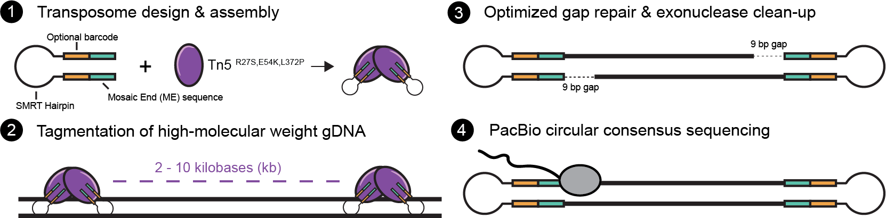

# SMRT-Tag: Sensitive multimodal profiling of native DNA by transposase-mediated single-molecule sequencing

<br>
<p align="center">

</p>

<br>


**SMRT-Tag** (**S**ingle **M**olecule **R**eal **T**ime sequencing by **T**ransposition) is a multiplexable, PCR-free approach for constructing low-input, single-molecule Pacific Biosciences sequencing libraries through Tn5 transposition.

 SMRT-Tag:
 * 📈 Requires **1-5% as much input material** as existing protocols 
 * 🔎 Enables highly-sensitive detection of variation and CpG methylation
 * 🧪 Can be combined with _in_ _situ_ adenine methyltransferase footprinting of nuclei (SAMOSA-Tag) to resolve chromatin fibers in low-input settings.

For more info, check out our manuscript:

* [Sensitive multimodal profiling of native DNA by transposase-mediated single-molecule sequencing.  Nanda A. S., Wu K., Kasinathan S., Ostrowski M. S., Clugston A. S., Satpathy A. T., Sweet-Cordero E. A., Goodarzi H., Ramani V.](link)

Interested in **trying out SMRT-Tag?** Check out our experimental protocols on **Protocols.io**:

* 🧬 📕 [SMRT-Tag on Protocols.io](link)

* 🧫 📕 [SAMOSA-Tag on Protocols.io](link)


---
<br>

# Analyses
This repo contains code for analyzing SMRT-Tag and SAMOSA-Tag data described in our manuscript. The processing workflow for data produced in this study is described in the two [associated jupyter notebooks](./notebooks/), [SMRT-Tag processing](./notebooks/SMRT-Tag_processing.ipynb) and [SAMOSA-Tag processing](./notebooks/SAMOSA-Tag_processing.ipynb).

Additionally, code for specific analyses can be found in the respective directory:

* [HG002/HG003/HG004 demultiplexing experiment](./demultiplex_genotype/README.md): Establishing the multiplexability of SMRT-Tag through a genotype-mixing experiment

* [HG002 variant calling](./variant_calling/README.md): Benchmarking variant calling performance of SMRT-Tag HG002 data versus established reference data. 

* [SAMOSA-ChAAT Computational Pipeline](./samosa-chaat/README.md): Detecting m6dA methylation on SAMOSA-Tag reads, and inferring single-molecule accessibility profiles. 

* [Modified IGV for single molecule accessibility footprint visualization](./igv-vis/README.md): Visualizing single-molecule accessibility profiles on single reads using a modified version of IGV.  

* [SAMOSA-Tag analyses & processing](./samosa_tag/README.md): Determining chromatin fiber types in SAMOSA-Tag data, and examinining variation in genome-wide fiber type distributions, stratified by 5mC methylation status.


## Requirements & Dependencies
All required software is described in [<code>conda.yml</code>](./envs/SMRT-Tag.yml) files. Separate environments are required for [`deepvariant`](./envs/deepvariant.yml) and [`hap.py`](./envs/happy.yml).

 We highly recommend setting up a conda environment using this <code>.yml</code> and <code>libmamba</code> solver, as follows:

```bash
conda env create -f SMRT-Tag.yml --experimental-solver=libmamba

conda env create -f happy.yml --experimental-solver=libmamba

conda env create -f deepvariant.yml --experimental-solver=libmamba
```

Additionally, to visualize single-molecule accessibiltly footprints in SAMOSA-Tag data, you will need <code>java11</code>. See [here](./igv-vis/README.md) for installation instructions.


# Data Availibility
All data produced in this study has been deposited on the NCBI SRA and GEO for ease of access.

HG002, HG003, HG004 SMRT-Tag Datasets:

* BioProject: [PRJNA863422](https://dataview.ncbi.nlm.nih.gov/object/PRJNA863422?reviewer=r09bii7m1mrad4ge0fjihq2n7g)


OS152 SAMOSA-Tag Datasets:

* GEO Experiment ID: [GSE210136](https://www.ncbi.nlm.nih.gov/geo/query/acc.cgi?acc=GSE210136)


# Disclaimer
All code is provided **as is**, with no guarantees. 

